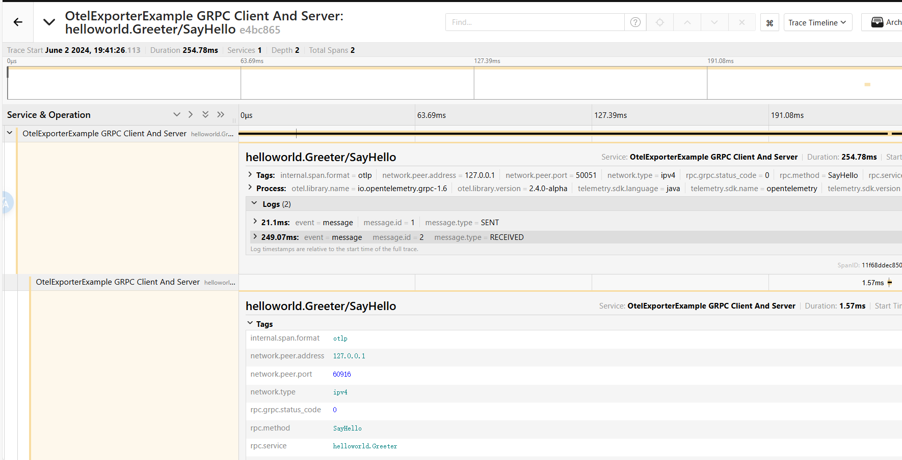

# GRPC Example

# How to run

## Prerequisites
* Be on the grpc project root folder 
```shell script
cd grpc/
```

## 1 - Compile
```shell script
../gradlew shadowJar
```

## 2 - Start the Server
```shell script
java -cp ./build/libs/opentelemetry-examples-grpc-0.1.0-SNAPSHOT-all.jar io.opentelemetry.examples.grpc.HelloWorldServer
```

## 3 - Start the Client
```shell script
java -cp ./build/libs/opentelemetry-examples-grpc-0.1.0-SNAPSHOT-all.jar io.opentelemetry.examples.grpc.HelloWorldClient
```

## Result 
### tracing
代码中可以搜索到   .setEndpoint("http://10.6.35.168:30017")   
图片中tracing 地址是  位于 `.setEndpoint("http://10.6.35.168:30017")`的otel collector将数据发送到了  jaeger
http://10.6.35.168:30686/search     

### metrics  
代码中可以搜索到   .setEndpoint("http://10.6.35.168:30017")
直接通过 get 拉取  otel collector的 metrics数据

```shell
# HELP otlp_exporter_exported_total 
# TYPE otlp_exporter_exported_total counter  
# 导出的span的总数 
otlp_exporter_exported_total{job="OtelExporterExample Client And Server",success="true",type="span"} 3
# HELP otlp_exporter_seen_total 
# TYPE otlp_exporter_seen_total counter
# 完成收集的总数 
otlp_exporter_seen_total{job="OtelExporterExample Client And Server",type="span"} 3
# HELP rpc_client_duration_milliseconds The duration of an outbound RPC invocation
# TYPE rpc_client_duration_milliseconds histogram  
# RPC请求的直方图  整个请求耗时落在哪个区间   单位 ms  
rpc_client_duration_milliseconds_bucket{job="OtelExporterExample Client And Server",network_type="ipv4",rpc_grpc_status_code="0",rpc_method="SayHello",rpc_service="helloworld.Greeter",rpc_system="grpc",server_address="localhost",server_port="50051",le="0"} 0
rpc_client_duration_milliseconds_bucket{job="OtelExporterExample Client And Server",network_type="ipv4",rpc_grpc_status_code="0",rpc_method="SayHello",rpc_service="helloworld.Greeter",rpc_system="grpc",server_address="localhost",server_port="50051",le="5"} 0
rpc_client_duration_milliseconds_bucket{job="OtelExporterExample Client And Server",network_type="ipv4",rpc_grpc_status_code="0",rpc_method="SayHello",rpc_service="helloworld.Greeter",rpc_system="grpc",server_address="localhost",server_port="50051",le="10"} 0
rpc_client_duration_milliseconds_bucket{job="OtelExporterExample Client And Server",network_type="ipv4",rpc_grpc_status_code="0",rpc_method="SayHello",rpc_service="helloworld.Greeter",rpc_system="grpc",server_address="localhost",server_port="50051",le="25"} 0
rpc_client_duration_milliseconds_bucket{job="OtelExporterExample Client And Server",network_type="ipv4",rpc_grpc_status_code="0",rpc_method="SayHello",rpc_service="helloworld.Greeter",rpc_system="grpc",server_address="localhost",server_port="50051",le="50"} 0
rpc_client_duration_milliseconds_bucket{job="OtelExporterExample Client And Server",network_type="ipv4",rpc_grpc_status_code="0",rpc_method="SayHello",rpc_service="helloworld.Greeter",rpc_system="grpc",server_address="localhost",server_port="50051",le="75"} 0
rpc_client_duration_milliseconds_bucket{job="OtelExporterExample Client And Server",network_type="ipv4",rpc_grpc_status_code="0",rpc_method="SayHello",rpc_service="helloworld.Greeter",rpc_system="grpc",server_address="localhost",server_port="50051",le="100"} 0
rpc_client_duration_milliseconds_bucket{job="OtelExporterExample Client And Server",network_type="ipv4",rpc_grpc_status_code="0",rpc_method="SayHello",rpc_service="helloworld.Greeter",rpc_system="grpc",server_address="localhost",server_port="50051",le="250"} 1
rpc_client_duration_milliseconds_bucket{job="OtelExporterExample Client And Server",network_type="ipv4",rpc_grpc_status_code="0",rpc_method="SayHello",rpc_service="helloworld.Greeter",rpc_system="grpc",server_address="localhost",server_port="50051",le="500"} 1
rpc_client_duration_milliseconds_bucket{job="OtelExporterExample Client And Server",network_type="ipv4",rpc_grpc_status_code="0",rpc_method="SayHello",rpc_service="helloworld.Greeter",rpc_system="grpc",server_address="localhost",server_port="50051",le="750"} 1
rpc_client_duration_milliseconds_bucket{job="OtelExporterExample Client And Server",network_type="ipv4",rpc_grpc_status_code="0",rpc_method="SayHello",rpc_service="helloworld.Greeter",rpc_system="grpc",server_address="localhost",server_port="50051",le="1000"} 1
rpc_client_duration_milliseconds_bucket{job="OtelExporterExample Client And Server",network_type="ipv4",rpc_grpc_status_code="0",rpc_method="SayHello",rpc_service="helloworld.Greeter",rpc_system="grpc",server_address="localhost",server_port="50051",le="2500"} 1
rpc_client_duration_milliseconds_bucket{job="OtelExporterExample Client And Server",network_type="ipv4",rpc_grpc_status_code="0",rpc_method="SayHello",rpc_service="helloworld.Greeter",rpc_system="grpc",server_address="localhost",server_port="50051",le="5000"} 1
rpc_client_duration_milliseconds_bucket{job="OtelExporterExample Client And Server",network_type="ipv4",rpc_grpc_status_code="0",rpc_method="SayHello",rpc_service="helloworld.Greeter",rpc_system="grpc",server_address="localhost",server_port="50051",le="7500"} 1
rpc_client_duration_milliseconds_bucket{job="OtelExporterExample Client And Server",network_type="ipv4",rpc_grpc_status_code="0",rpc_method="SayHello",rpc_service="helloworld.Greeter",rpc_system="grpc",server_address="localhost",server_port="50051",le="10000"} 1
rpc_client_duration_milliseconds_bucket{job="OtelExporterExample Client And Server",network_type="ipv4",rpc_grpc_status_code="0",rpc_method="SayHello",rpc_service="helloworld.Greeter",rpc_system="grpc",server_address="localhost",server_port="50051",le="+Inf"} 1
rpc_client_duration_milliseconds_sum{job="OtelExporterExample Client And Server",network_type="ipv4",rpc_grpc_status_code="0",rpc_method="SayHello",rpc_service="helloworld.Greeter",rpc_system="grpc",server_address="localhost",server_port="50051"} 242.44679
rpc_client_duration_milliseconds_count{job="OtelExporterExample Client And Server",network_type="ipv4",rpc_grpc_status_code="0",rpc_method="SayHello",rpc_service="helloworld.Greeter",rpc_system="grpc",server_address="localhost",server_port="50051"} 1
# HELP rpc_server_duration_milliseconds The duration of an inbound RPC invocation
# TYPE rpc_server_duration_milliseconds histogram
# RPC请求的直方图  整个请求耗时落在哪个区间   单位 ms    
# 请求总数和请求耗时
rpc_server_duration_milliseconds_bucket{job="OtelExporterExample Client And Server",network_type="ipv4",rpc_grpc_status_code="0",rpc_method="SayHello",rpc_service="helloworld.Greeter",rpc_system="grpc",server_address="localhost",server_port="50051",le="0"} 0
rpc_server_duration_milliseconds_bucket{job="OtelExporterExample Client And Server",network_type="ipv4",rpc_grpc_status_code="0",rpc_method="SayHello",rpc_service="helloworld.Greeter",rpc_system="grpc",server_address="localhost",server_port="50051",le="5"} 2
rpc_server_duration_milliseconds_bucket{job="OtelExporterExample Client And Server",network_type="ipv4",rpc_grpc_status_code="0",rpc_method="SayHello",rpc_service="helloworld.Greeter",rpc_system="grpc",server_address="localhost",server_port="50051",le="10"} 2
rpc_server_duration_milliseconds_bucket{job="OtelExporterExample Client And Server",network_type="ipv4",rpc_grpc_status_code="0",rpc_method="SayHello",rpc_service="helloworld.Greeter",rpc_system="grpc",server_address="localhost",server_port="50051",le="25"} 2
rpc_server_duration_milliseconds_bucket{job="OtelExporterExample Client And Server",network_type="ipv4",rpc_grpc_status_code="0",rpc_method="SayHello",rpc_service="helloworld.Greeter",rpc_system="grpc",server_address="localhost",server_port="50051",le="50"} 3
rpc_server_duration_milliseconds_bucket{job="OtelExporterExample Client And Server",network_type="ipv4",rpc_grpc_status_code="0",rpc_method="SayHello",rpc_service="helloworld.Greeter",rpc_system="grpc",server_address="localhost",server_port="50051",le="75"} 3
rpc_server_duration_milliseconds_bucket{job="OtelExporterExample Client And Server",network_type="ipv4",rpc_grpc_status_code="0",rpc_method="SayHello",rpc_service="helloworld.Greeter",rpc_system="grpc",server_address="localhost",server_port="50051",le="100"} 3
rpc_server_duration_milliseconds_bucket{job="OtelExporterExample Client And Server",network_type="ipv4",rpc_grpc_status_code="0",rpc_method="SayHello",rpc_service="helloworld.Greeter",rpc_system="grpc",server_address="localhost",server_port="50051",le="250"} 3
rpc_server_duration_milliseconds_bucket{job="OtelExporterExample Client And Server",network_type="ipv4",rpc_grpc_status_code="0",rpc_method="SayHello",rpc_service="helloworld.Greeter",rpc_system="grpc",server_address="localhost",server_port="50051",le="500"} 3
rpc_server_duration_milliseconds_bucket{job="OtelExporterExample Client And Server",network_type="ipv4",rpc_grpc_status_code="0",rpc_method="SayHello",rpc_service="helloworld.Greeter",rpc_system="grpc",server_address="localhost",server_port="50051",le="750"} 3
rpc_server_duration_milliseconds_bucket{job="OtelExporterExample Client And Server",network_type="ipv4",rpc_grpc_status_code="0",rpc_method="SayHello",rpc_service="helloworld.Greeter",rpc_system="grpc",server_address="localhost",server_port="50051",le="1000"} 3
rpc_server_duration_milliseconds_bucket{job="OtelExporterExample Client And Server",network_type="ipv4",rpc_grpc_status_code="0",rpc_method="SayHello",rpc_service="helloworld.Greeter",rpc_system="grpc",server_address="localhost",server_port="50051",le="2500"} 3
rpc_server_duration_milliseconds_bucket{job="OtelExporterExample Client And Server",network_type="ipv4",rpc_grpc_status_code="0",rpc_method="SayHello",rpc_service="helloworld.Greeter",rpc_system="grpc",server_address="localhost",server_port="50051",le="5000"} 3
rpc_server_duration_milliseconds_bucket{job="OtelExporterExample Client And Server",network_type="ipv4",rpc_grpc_status_code="0",rpc_method="SayHello",rpc_service="helloworld.Greeter",rpc_system="grpc",server_address="localhost",server_port="50051",le="7500"} 3
rpc_server_duration_milliseconds_bucket{job="OtelExporterExample Client And Server",network_type="ipv4",rpc_grpc_status_code="0",rpc_method="SayHello",rpc_service="helloworld.Greeter",rpc_system="grpc",server_address="localhost",server_port="50051",le="10000"} 3
rpc_server_duration_milliseconds_bucket{job="OtelExporterExample Client And Server",network_type="ipv4",rpc_grpc_status_code="0",rpc_method="SayHello",rpc_service="helloworld.Greeter",rpc_system="grpc",server_address="localhost",server_port="50051",le="+Inf"} 3
rpc_server_duration_milliseconds_sum{job="OtelExporterExample Client And Server",network_type="ipv4",rpc_grpc_status_code="0",rpc_method="SayHello",rpc_service="helloworld.Greeter",rpc_system="grpc",server_address="localhost",server_port="50051"} 36.663661
rpc_server_duration_milliseconds_count{job="OtelExporterExample Client And Server",network_type="ipv4",rpc_grpc_status_code="0",rpc_method="SayHello",rpc_service="helloworld.Greeter",rpc_system="grpc",server_address="localhost",server_port="50051"} 3
```


