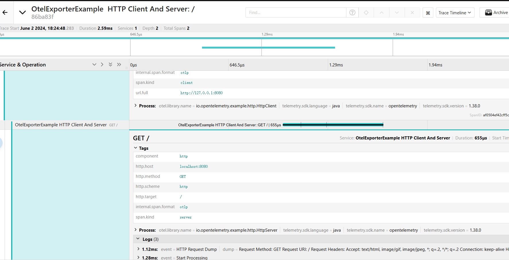

# HTTP Example

# How to run

## Prerequisites
* Java 1.8.231
* Be on the project root folder

## 1 - Compile 
```shell script
../gradlew shadowJar
```

## 2 - Start the Server
```shell script
java -cp ./build/libs/opentelemetry-examples-http-0.1.0-SNAPSHOT-all.jar io.opentelemetry.example.http.HttpServer
```
 
## 3 - Start the Client
```shell script
java -cp ./build/libs/opentelemetry-examples-http-0.1.0-SNAPSHOT-all.jar io.opentelemetry.example.http.HttpClient
```

## 结果 

## tracing  
代码中可以搜索到  `.setEndpoint("http://10.6.35.168:30017") `  
图片中tracing 地址是  位于 `.setEndpoint("http://10.6.35.168:30017")`的otel collector将数据发送到了  jaeger
http://10.6.35.168:30686/search   


## metrics 
代码中可以搜索到  `` .setEndpoint("http://10.6.35.168:30017")`
直接通过 get 拉取  otel collector的 metrics数据

```shell
↪ curl -v http://10.6.35.168:30088/metrics                                                                                                                
# HELP http_client_duration_milliseconds The duration of HTTP requests
# TYPE http_client_duration_milliseconds histogram
http_client_duration_milliseconds_bucket{http_method="GET",http_status_code="200",http_url="http://127.0.0.1:8080",job="OtelExporterExample  HTTP Client And Server",le="0"} 0
http_client_duration_milliseconds_bucket{http_method="GET",http_status_code="200",http_url="http://127.0.0.1:8080",job="OtelExporterExample  HTTP Client And Server",le="5"} 28
http_client_duration_milliseconds_bucket{http_method="GET",http_status_code="200",http_url="http://127.0.0.1:8080",job="OtelExporterExample  HTTP Client And Server",le="10"} 35
http_client_duration_milliseconds_bucket{http_method="GET",http_status_code="200",http_url="http://127.0.0.1:8080",job="OtelExporterExample  HTTP Client And Server",le="25"} 35
http_client_duration_milliseconds_bucket{http_method="GET",http_status_code="200",http_url="http://127.0.0.1:8080",job="OtelExporterExample  HTTP Client And Server",le="50"} 35
http_client_duration_milliseconds_bucket{http_method="GET",http_status_code="200",http_url="http://127.0.0.1:8080",job="OtelExporterExample  HTTP Client And Server",le="75"} 36
http_client_duration_milliseconds_bucket{http_method="GET",http_status_code="200",http_url="http://127.0.0.1:8080",job="OtelExporterExample  HTTP Client And Server",le="100"} 36
http_client_duration_milliseconds_bucket{http_method="GET",http_status_code="200",http_url="http://127.0.0.1:8080",job="OtelExporterExample  HTTP Client And Server",le="+Inf"} 36
http_client_duration_milliseconds_sum{http_method="GET",http_status_code="200",http_url="http://127.0.0.1:8080",job="OtelExporterExample  HTTP Client And Server"} 203
http_client_duration_milliseconds_count{http_method="GET",http_status_code="200",http_url="http://127.0.0.1:8080",job="OtelExporterExample  HTTP Client And Server"} 36
# HELP http_client_requests_total The number of HTTP requests
# TYPE http_client_requests_total counter
http_client_requests_total{job="OtelExporterExample  HTTP Client And Server"} 36
# HELP otlp_exporter_exported_total
# TYPE otlp_exporter_exported_total counter
otlp_exporter_exported_total{job="OtelExporterExample  HTTP Client And Server",success="true",type="span"} 36
# HELP otlp_exporter_seen_total
# TYPE otlp_exporter_seen_total counter
otlp_exporter_seen_total{job="OtelExporterExample  HTTP Client And Server",type="span"} 36
```